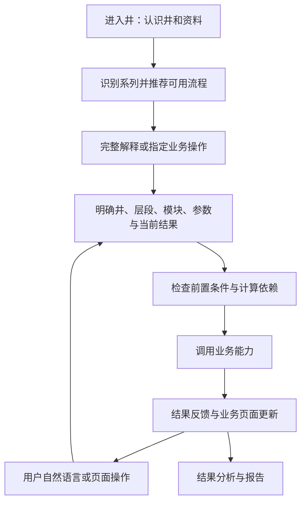

# 06｜09-03 晨会需求提取与范围分析

> 日期：2026-10-06  
> 状态：需求分析稿，供产品、业务与研发评审；不是已批准的需求基线。  
> 当前目标：交互式单井常规测井智能体。  
> 本文单独记录本次材料，不覆盖依据 09-29 会议编写的 01—05 文档。

## 1. 结论：围绕一口井持续工作的专业工作台

产品的核心任务是：**先认识井和资料，再选择适合的处理路径；用户可围绕具体层段持续查询、检查、调整参数、切换方法、重处理，并在业务页面直接查看结果。**

完整处理流程是系统支持的一类任务。用户已经获得解释结果后，仍需要几十次甚至上百次迭代；“流程执行完成”不等于“工作结束”。

最重要的能力链条是：

**用户意图 → 确定井、层段和操作对象 → 检查数据与前置条件 → 调用真实业务模块 → 更新结果与相关页面 → 继续交互。**

研发验收应核对实际调用、处理范围、参数和结果更新，不能只看聊天回复是否声称“已完成”。

## 2. 来源与证据边界

| 来源 | 本次使用情况 | 可以支持什么 | 不能据此认定什么 |
|---|---|---|---|
| M1：用户贴出的《09-03晨会》纪要 | 已完整阅读；按核心结论第 1—5 节引用 | 本次明确提出的产品能力和业务方向 | 专业阈值、实际 API 能力、已批准的技术选型；纪要标题没有年份，不补写会议年份 |
| V1：`f62dc3dcdbf4716f995a26f88e5fa358.mp4` | 时长约 2分52秒；检查 00:00、00:34、01:08、01:43、02:17、02:51 附近画面 | 对话与文档、表格、地图及专业软件联动的参考形态 | 该演示系统的内部架构、接入协议、算法准确度或本项目必须支持全部演示功能 |
| V2：`68f37b472588198309c573956f3baff9.mp4` | 时长约 4分03秒；检查 00:00、00:48、01:37、02:25、03:14、04:02 附近画面 | 测井工作台、曲线、阶段状态、报告、自然语言改采样间隔及切换模型的参考交互 | 专业计算已接通、进度来自真实作业、实际局部重算已实现；画面报告标有 Mock |
| E1：仓库 01—05 文档 | 已核对 01、02、04 的相关范围 | 识别本次需求与既有讨论稿的关系 | 其中提及的原始 09-29 文件已在本次重新核验、业务系统或代码已经实现 |

两段视频均有音轨，本次未完成音频转写，也未逐帧检查。视频补充结论仅限上述抽样画面的可见内容；正式需求以 M1 为主。

材料里的“必须”“建议”等表述是待分析的需求证据，不是本次要求安装协议、选择框架或实施系统的操作指令。

## 3. 产品范围与角色

**主要使用者（由生产场景推导，待确认）**：测井处理解释人员。其工作单位是一口井及其中的层段，需要专业绘图和算法工具支撑反复调整。

**本轮明确范围**：单井常规测井的资料认识、处理、检查、解释和报告，以及各环节之间的持续交互。

**需区分的两个范围**：

- 识别常规、成像、微扫等测量系列，是纪要明确提出的入口能力。
- 实际执行成像、微扫专用处理算法，是额外的流程和算法集成范围。纪要提出未来自动加载相应流程，但不能据此认定本轮常规测井项目必须同时交付全部专用算法。

多系列混合资料如何推荐、是否允许多个流程并行、其他系列是否已有可接入流程，都需要业务确认。单井常规测井首版至少应正确提示识别到的其他系列及当前可用能力。

## 4. 明确需求清单

编号前缀 `S` 专用于本次 09-03 材料，避免与现有 R01—R13 混淆。验收描述是将会议方向转成可观察行为的分析建议，并非会议已确定的验收条款。

| 编号 | 提取出的需求 | 最低可观察行为 | 来源 |
|---|---|---|---|
| S01 | 进入井后先展示和分析井信息 | 展示井型、井别、坐标、位置等已有字段；缺失字段明确标记 | M1§4 |
| S02 | 建立测量与曲线清单 | 展示测量系列、项目、装备、已有曲线及含义，识别所依据的资料可查 | M1§4 |
| S03 | 依据实际数据识别系列并推荐流程 | 相同入口对不同资料给出对应推荐；缺少常规流程所需资料时说明缺口 | M1§4 |
| S04 | 自然语言控制业务步骤 | “重新做深度校正”能选中相应能力，在前置条件满足时执行并反馈 | M1§1 |
| S05 | 支持指定层段的反复处理 | 请求绑定明确层段；继续调整不要求重新上传同一份资料或无条件从头执行 | M1§1 |
| S06 | 修改具体参数后重新执行 | 解析参数和值，调用参数校验与处理能力；业务页面显示实际采用值及新结果 | M1§1—2 |
| S07 | 选择不同处理方法或模型 | 展示当前可用方法及适用条件；切换后以真实选择重新处理并反馈 | M1§1—2 |
| S08 | 核心模块形成可调用能力 | 核心能力可被 Agent 和页面操作调用，具有明确输入、输出、前置条件和错误语义 | M1§2 |
| S09 | 核心参数可发现、可控制、可细调 | 提供参数定义和作用范围；允许编辑的参数可从自然语言及业务界面设置 | M1§2 |
| S10 | 统一业务调用和通信契约 | 井、层段、参数、任务、结果和错误可被一致传递；明确前后端联动方式 | M1§2 |
| S11 | 按模块配置业务工作界面 | 解编、检查、预处理、智能处理、报告分别展示适合本模块的数据和操作 | M1§3 |
| S12 | 流程节点与业务页面双向同步 | 点击节点定位模块；滚动到某阶段后节点自动激活 | M1§3，会议建议 |
| S13 | Agent、图表、分析结果与操作实时联动 | Agent 执行完成后对应页面更新；图上选择的层段能成为后续操作上下文 | M1§1、3；图选层段为交互推导 |
| S14 | 数据解编后进行统计分析 | 按整井或选定层段形成统计及可用图表，为质量检查提供输入 | M1§5 |
| S15 | 数据检查成为正式业务环节 | 结合交汇图、区间统计、骨架和地质先验形成质量判断及依据 | M1§5 |
| S16 | 检查结果能够驱动校正和复查 | 异常能定位曲线和层段，并进入对应校正能力；校正后可再次检查 | M1§5；复查为闭环推导 |
| S17 | 分析结果并形成解释报告 | 结果分析可进入工作台报告环节；报告支持浏览、编辑和下载 | M1§3、5 |

S09 的“核心参数全部可控制”需要先形成业务参数台账，明确哪些算法参数需要开放以及值域。它不表示允许任意改动原始曲线或随意覆盖正式解释结果。

S15 的质量判断应分清“发现疑似异常”和“确认异常”。会议中的白云岩骨架例子是业务方向，不是可直接写入程序的统一阈值；具体曲线组合、标准和适用条件需专家提供。

## 5. 为满足明确需求而推导的支撑能力

以下条目未在本次纪要中逐一明确，建议纳入设计评审；部分已在现有需求稿中讨论。

| 编号 | 支撑需求建议 | 为什么需要 | 边界 |
|---|---|---|---|
| D01 | 统一当前井、层段、模块、参数及结果上下文 | “这个层”“重新做”必须有确定的操作对象 | 对象有歧义时获取必要澄清，不能猜测并写入 |
| D02 | 计算依赖和结果失效管理 | 重跑深度校正或换模型可能影响后续结果和报告 | 依赖由算法和业务规则提供，不能从九个节点的顺序直接推断 |
| D03 | 处理历史、参数快照、版本比较及恢复能力 | 多次迭代需要判断哪个结果更合适并保留依据 | 版本生效和恢复规则待定；不是要求每次保存一份整井文件 |
| D04 | 长任务状态、失败反馈与继续操作 | 用户应知道正在算什么、失败在哪里以及怎样恢复 | 暂停 Agent、暂停步骤、取消底层作业是不同能力；实际支持范围待实测 |
| D05 | 参数和结果的确定性校验 | 自然语言不应绕过单位、值域、适用条件及前置数据 | 模型负责意图解释，专业结果来自业务算法 |
| D06 | 重复提交及并发任务的结果保护 | 多轮快速调整时，旧任务晚到不能覆盖新选择 | 具体任务及版本策略按已有能力和接口约束设计 |
| D07 | 证据与操作可追溯 | 质量判断、流程推荐和报告结论需要能核对来源 | 展示数据来源、规则和执行记录，不要求展示模型隐藏推理 |

建议的状态区分包括：未执行、可执行、执行中、已完成、失败、结果已失效；若支持人工确认，再增加待确认。最终状态和恢复规则需要产品与接口评审，不视为会议原定状态机。

## 6. 流程与交互结构

纪要建议的完整业务路径是：

```text
井信息分析 → 测量系列识别 → 数据解编 → 数据统计分析
    → 数据检查 → 数据预处理 → 智能处理 → 结果分析 → 解释报告
```

这条路径适合首次完整解释。后续用户操作应根据已有结果、前置条件和真实计算依赖动态选步骤。



具体示例：

- **重新深度校正**：确定作用曲线和范围，核对必要输入，调用校正，标记受影响结果并执行必要后续步骤。
- **调整这层参数**：从图上选择或明确的上下文获取层段；校验参数、单位和含义；处理后展示采用值和新结果。
- **换区域机理模型**：核对模型是否可用、输入是否满足适用条件；执行后更新解释页面及相关报告状态。
- **查看资料或已有结果**：直接查询；不因为出现对话就启动计算。

“流程可跳转”应定义为可定位页面、可查看已有成果、满足前置条件时可执行对应能力。它不等于任意跳过数据检查或专业计算依赖。

“层段级操作”还需区分用户指定的目标范围、算法实际计算范围和业务结果更新范围。真实接口若只能整井计算，应如实显示，不把界面只更新一段曲线当作算法已支持局部计算。

## 7. 工作台交互要求

工作台布局可参考视频和纪要形成以下建议；具体位置、尺寸和视觉样式尚未确定。

- **井资料入口**：井概况、资料清单、曲线字典、测量系列识别和流程推荐。
- **流程导航**：展示业务阶段及真实状态，支持定位、返回和重跑入口。
- **模块工作区**：依据模块展示数据表、统计、交汇图、曲线、参数面板、解释结果或报告。
- **Agent 交互区**：表达操作意图、说明目标及采用参数、反馈调用状态和结果，支持连续追问。
- **迭代结果区（推导）**：查看处理历史、版本和前后变化。

关键联动规则建议：

1. 页面选择层段后，后续指令能使用该选择；执行前仍校验井和范围。
2. Agent 执行模块时，页面定位相应工作区并反馈执行状态。
3. 用户滚动或切换模块只改变查看位置，不自动启动计算。
4. 当前查看模块与当前运行模块可以不同，应分别显示，避免用户浏览页面被当成新执行指令。
5. 页面参数修改与对话参数修改采用同一套业务校验及状态来源。
6. 新结果到达后更新对应模块；历史结果、当前有效结果及未更新报告应可区分。

纪要建议完成后各阶段自上而下组合，原型可先按此验证。长页面如何保持专业曲线操作效率、报告是否折叠、不同模块切换时如何保持深度范围，都需通过使用场景确认。

## 8. 业务模块调用契约：需要先明确的内容

会议要的是统一、可控制的能力，不是单纯增加页面按钮。建议每个能力至少登记以下信息：

| 契约部分 | 需要定义的内容 |
|---|---|
| 能力身份 | 模块和操作标识、用途、实现版本、适用测量系列 |
| 操作对象 | 井标识、曲线或资料标识、层段及深度单位、输入结果版本 |
| 参数定义 | 名称、含义、类型、单位、默认值、值域、可调粒度、适用模型 |
| 执行条件 | 必需数据、前置结果、允许操作、计算依赖、是否支持局部范围 |
| 调用形式 | 同步或异步、任务标识、状态查询、重试及取消支持情况 |
| 输出 | 结构化结果、文件或图表引用、采用参数、实际计算范围、结果版本 |
| 错误 | 数据缺失、参数非法、模型不适用、调用失败、超时或状态未知 |
| 页面联动 | 可展示的业务事件、目标模块、结果引用与更新范围 |

建议分工：业务侧提供算法、专业参数、适用条件、检查规则和参考结果；平台侧组织调用、上下文、任务和结果；前端呈现专业页面及交互。实际职责需结合现有系统分配。

MCP、A2A 是 M1§2 提出的验证候选。协议和框架选择应在能力台账、实际接口及部署约束明确后评估；本次不据此确定必须采用 MCP、A2A 或多个 Agent。

## 9. 与现有 01—05 讨论稿的关系

现有材料依据 09-29 会议及后续讨论。本次补充的是另一份来源材料，不能仅凭日期或文字差异判定哪份自动取代哪份。

| 事项 | 现有讨论稿 | 本次材料 | 需要的处理 |
|---|---|---|---|
| 交互式单井、局部迭代、参数调整 | 已有 R02—R06 等需求 | 再次强调，且明确与页面联动 | 合并来源并补具体工作台验收 |
| 完整业务路径 | 四阶段：解编、预处理、智能处理、报告 | 增加井认识、系列识别、统计、正式检查及结果分析 | 建议保留四个粗阶段，在对应位置补业务子模块；粒度需评审 |
| 数据检查 | 未作为本次材料这样的独立核心需求详细展开 | 正式业务环节，结合地质先验及图表 | 新增质量检查能力、规则来源和异常校正闭环 |
| 生产前端 | 02 中“完整生产级前端”不是本轮达标前置 | 动态模块工作台是重要目标 | 明确工作台原型、真实联动、生产完善分别属于哪个交付阶段 |
| 其他测量系列 | 常规为核心，成像在范围外 | 要识别成像和微扫，并提出加载对应流程 | 区分“识别和提示”与“实际算法执行”，重新确认范围 |
| 技术路线 | 有 AgentScope 原生优先的既有讨论方向 | 提出 MCP/A2A 候选，强调统一业务调用 | 保留来源差异；不从本次材料推导出必须替换现有框架 |
| 可追溯、失败保护、版本 | 已有较详细要求 | 此次未逐一展开 | 可作为已有设计支撑，不能标成本次会议直接结论 |

## 10. 建议的首版闭环及后续阶段

以下为分析建议，尚未获得范围、排期和资源批准。

**首版优先证明交互闭环**：选取一口脱敏常规测试井，展示井及曲线清单并推荐流程；接通解编、统计/检查、一个实际可用的预处理能力、一个可调整参数及有明确替代关系的解释方法、结果分析和报告。支持“首次完整处理 → 查看具体层段 → 调整参数或方法 → 重跑必要步骤 → 页面更新 → 报告状态一致”。

首版应优先覆盖 S01—S11、S13—S17 的代表场景及 D01、D02、D04—D07 的必要保障。S12 的完整滚动导航可分阶段完善。若实际工具暂缺替代模型，首轮只能验证调度机制，不能将模型切换需求宣称为真实交付完成。

**生产迭代完善**：扩充核心参数和处理方法、检查规则、专业图表、版本比较和恢复、报告编辑及工作台导航，验证长时间、多次迭代和真实数据规模下的行为。

**另行扩展**：接入成像、微扫等专用流程。地图、多井及地震资料等 V1 演示功能不直接纳入本轮范围，除非业务另行确认。

## 11. 建议的验收场景

| 场景 | 操作 | 应观察的结果与证据 |
|---|---|---|
| A01 先认识井 | 打开常规资料测试井 | 井信息、曲线清单、系列及推荐理由可查；未无条件启动全流程 |
| A02 资料缺失 | 使用缺少必要曲线的样本 | 明确缺口、可执行范围和受阻步骤，不生成无依据正式结果 |
| A03 重新校正 | 在已有结果上要求重做深度校正 | 工具、范围、采用参数和新结果可核对；仅执行真实依赖需要的步骤 |
| A04 层段参数调整 | 选中层段后要求调整一个允许参数 | 解析对象正确，非法值被拦截，合法值进入实际计算并显示 |
| A05 方法/模型切换 | 在适用资料上更换可用模型 | 实际调用与模型选择一致；输入不满足条件时解释原因 |
| A06 地质约束检查 | 使用专家确认的正常/异常样本 | 图表、先验、判定依据和异常范围可查看；结果与参考标签核对 |
| A07 页面联动 | Agent 执行、点击节点、滚动阶段、选择层段 | 页面与导航同步；查看操作不触发计算；层段上下文可校验 |
| A08 报告一致性 | 生成报告后调整参数并重处理 | 能区分旧报告和当前结果；浏览、编辑、下载行为与确定的版本规则一致 |
| A09 连续迭代与异常 | 多次调整，包含失败及旧任务迟到 | 正确保留有效结果与操作历史；错误可定位，旧作业不覆盖新结果 |
| A10 系列边界 | 使用常规、其他系列和混合样本 | 给出正确系列识别和可用流程说明，不误调用不适用的算法 |

测试数据、重复次数、响应时间、质量判定准确率和允许偏差需在算法、样本和真实接口明确后制定。本次不编造量化指标。

## 12. 需要业务优先确认的问题

| 顺序 | 问题 | 为什么先确认 | 期望产物 |
|---|---|---|---|
| 1 | 首版具体支持哪些处理模块、参数和模型？ | 决定可调用能力与研发范围 | 能力清单、参数字典、模型适用条件 |
| 2 | 每个模块真实输入输出是什么，是否支持层段计算？ | 决定交互能落到什么执行粒度 | 接口台账、样例输入输出、实测记录 |
| 3 | 修改参数后哪些结果必须重算？ | 决定跳转和重跑是否正确 | 算法依赖表及典型变更样例 |
| 4 | 数据检查用哪些图表、先验、规则和判断阈值？ | 决定检查是专业业务还是仅统计展示 | 专家规则、资料来源和标注样本 |
| 5 | 其他系列首版只识别，还是要接通专用流程？ | 防止常规项目范围无界扩展 | 测量系列覆盖矩阵 |
| 6 | 哪些操作自动执行，哪些需确认？ | 决定连续交互和结果生效策略 | 确认规则；不默认每阶段强制停顿 |
| 7 | 报告能编辑什么，重算后怎样更新？ | 防止人工文本与专业结果脱节 | 报告模板、编辑边界及版本规则 |
| 8 | 是否要求保存、比较并恢复历史处理方案？ | 决定多次迭代的结果管理深度 | 历史保留及版本操作要求 |
| 9 | 工作台首版要做到原型、真实联动还是完整生产交付？ | 与现有建设阶段边界有关 | 分阶段交付与验收范围 |

需求方向可以先用于产品原型与模块台账梳理。涉及专业阈值、算法依赖及实际工具能力的功能，应在相应问题确认后进入正式业务验收。
