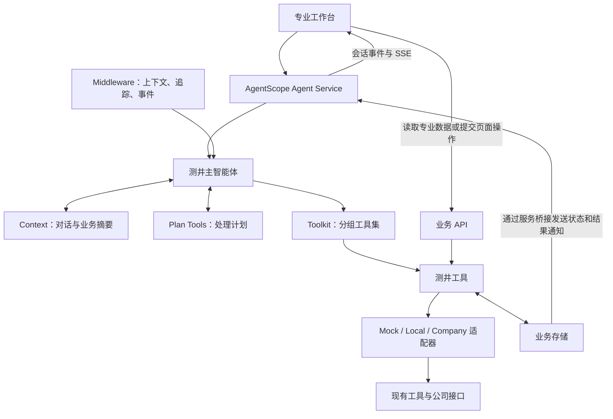

# 技术框架概要

> 日期：2026-10-06
>
> 状态：设计基线。2026-10-07 调整模型工具：专业能力直接注册，补齐已有层段查询、参数读取与修改、指定步骤重跑，完整解释由 Skill 按十项专业步骤组织；底层专业服务仍待接入。

## 一、框架目标与依据

本方案采用 AgentScope Agent Service 承载应用。一个测井主智能体通过分组工具集调用业务能力。专业工作台显示资料、执行状态和结果。

AgentScope 管理智能体运行、模型调用和工具选择。AgentScope 也管理会话、上下文、计划和交互事件。

测井业务模块提供专业工具。业务存储保存数据和执行事实。框架扩展接口连接这些模块。

本方案使用以下资料：

- [产品需求概要](./产品需求文档.md)。
- [项目目标概要](./项目目标概要.md)。
- [项目评估概要](./项目评估概要.md)。
- [现有工具映射文档](/Users/heyutao/Code/personal/cnlc-agentscope/docs/architecture/four-stage-tool-mapping.md)。
- [用户提供的阶段使用示意图](./assets/工具阶段使用情况-2026-10-06.png)。
- [Mock 井数据](/Users/heyutao/Code/personal/cnlc-agentscope/mock_data/WELL_MOCK_PLOT_001.json)。

工具映射文档说明现有工具能力。阶段使用示意图说明完整解释顺序、步骤产出和停止规则。Mock 井提供演示资料。旧项目的交互设计不作为本方案依据。

本概要规定组件职责和接入方式。后续详细设计补齐参数字典、专业计算依赖和接口字段。

[详细技术框架方案](./详细技术框架方案.md)已定义应用侧接口、数据、执行和验证设计。专业信息暂缺时，系统通过能力状态和配置入口保留限制。

## 二、术语与总体架构

### 2.1 术语

| 名称 | 含义 |
|---|---|
| 主智能体 | 基于 AgentScope `Agent` 配置的测井智能体 |
| 工具 | 主智能体可以调用的业务能力，对应 Tool |
| 工具集 | 注册和分组工具的组件，对应 Toolkit |
| 适配器 | 连接 Mock 数据、本地工具或公司接口的组件，对应 Adapter |
| 业务存储 | 保存业务数据和执行事实的组件，对应 Business Store |
| 文件存储 | 保存曲线和文件的组件，对应 Artifact Store |
| 业务运行记录 | 工具实际执行时生成的记录 |
| 结果版本 | 一次处理生成并保存的结果 |
| 生效 | 系统将某个结果版本设为当前有效结果 |

### 2.2 总体架构



首版以一个应用部署这些组件。首版不将这些组件拆成微服务。

主智能体可以服务多个会话。每个会话保存独立的运行状态和业务绑定。

## 三、AgentScope 组件职责

本方案以 AgentScope 2.0.9 为版本基线。开发时固定具体依赖版本。下表依据官方对应版本文档。

| 组件 | 职责 |
|---|---|
| `Agent` | 主智能体理解指令、选择工具、组织处理、请求澄清并解释实际结果。 |
| Model / Credential | 模型组件配置供应商和模型参数。凭据组件提供服务端凭据。 |
| `Toolkit` / Tool Group | 工具集注册业务工具并提供参数 Schema。工具组按业务划分工具。 |
| `ToolBase` / `FunctionTool` | 工具接口包装现有函数、组件或 HTTP 适配器。 |
| Context | 上下文保存近期对话和业务摘要。上下文压缩过长内容。上下文将相关内容保存到外部存储。 |
| Plan Tools | 计划工具记录四阶段计划或指定操作的计划。计划工具记录准备执行的步骤和进度。 |
| Middleware | 中间件注入上下文。中间件记录追踪信息并桥接业务事件。 |
| Permission / HITL | 框架支持业务操作确认。工具仍检查权限和对象归属。 |
| Agent Service | 服务管理会话和运行。服务提供存储适配、消息总线和 SSE。服务支持后台工具运行与结果回传。 |

官方参考资料：

- [稳定版首页](https://docs.agentscope.io/en/versions/2.0.9/index)。
- [Python Tool](https://docs.agentscope.io/en/versions/2.0.9/building-blocks/tool/python-tool)。
- [Context](https://docs.agentscope.io/en/versions/2.0.9/building-blocks/context/overview)。
- [Agent Service](https://docs.agentscope.io/en/versions/2.0.9/deploy/agent-service)。

Agent Service 接入测井工具和中间件。专业数据接口扩展到同一服务。会话管理和通用后台运行优先使用框架机制。

业务存储单独保存业务运行记录。系统通过标识关联业务运行记录和会话事件。

服务默认可能提供文件工具和 Shell 工具。接入时必须完成以下检查：

1. 限制工具集中的业务能力。
2. 验证最终工具清单。
3. 验证工作区隔离配置。

主智能体只能使用已开放的能力。

## 四、四阶段处理与停止规则

### 4.1 完整解释顺序

模型通过常规测井解释 Skill 组织以下顺序。系统提示词只规定通用职责，不重复阶段表。专业工具可以独立调用；单项请求不自动执行完整流程。原型 HTTP 接口保留固定场景 Workflow，用于独立的业务演示。


| 阶段 | 步骤 | 处理内容 | 主要产出 |
|---|---|---|---|
| 资料准备 | data_preparation | 系统确定当前井。系统加载原始资料和辅助资料。 | 井信息、资料清单、来源、版本 |
| 预处理与质量控制 | 资料完整性检查与曲线质量检查 | 系统检查资料要求。工具预处理数据并检查质量。 | 缺失项、告警、继续条件、质量结果、处理记录、处理后资料 |
| 专业解释与验证 | 岩性识别至报告前检查 | 工具生成专业结果。验证能力检查证据。系统检查完成情况和未解决问题。 | 岩性、物性、流体、分类、层段、验证、最终检查结果 |
| 报告生成 | 报告前检查之后 | 报告工具汇总指定版本的结果。 | 正式报告或诊断报告。报告类型取决于任务终态和报告规则。 |

业务阶段组织处理和工作台展示。工具组管理工具能力。业务阶段与工具组不要求一一对应。

### 4.2 步骤与现有能力

| 步骤 | 工具或组件 | 职责与产出 |
|---|---|---|
| data_preparation | `get_well_data` | 工具加载当前井的资料。工具记录资料来源和版本。 |
| data_completeness | `check_data_completeness` | 工具调用本地完整性规则，返回缺失资料、缺失有效值和继续条件。 |
| curve_quality | `check_curve_quality`、公司预处理能力 | 工具预处理数据并检查质量。工具返回质量结果、处理记录和处理后资料。 |
| lithology_identification | `identify_lithology` | 工具提供岩性结果和依据。 |
| petrophysical_evaluation | `evaluate_petrophysics` | 工具提供泥质、孔隙度、渗透率等结果。 |
| sw_and_fluid_identification | `calculate_sw`、可用流体识别能力或既有综合组件 | 对应能力获取含水饱和度并识别流体。对应能力记录证据和不确定项。 |
| layer_classification | 可用 `classify_layer` 或既有综合组件 | 对应能力提供油气水层分类和依据。 |
| interval_merging | `merge_intervals` | 工具整理层界、层段和厚度结果。正式厚度规则仍需业务验收。 |
| interpretation_validation | 既有验证组件，或对应路径中可用的 `validate_interpretation` | 对应能力使用岩心、录井、试油、邻井等资料验证结果。对应能力返回一致性、冲突和复核建议。 |
| 报告前检查 | 本地最终检查，可用路径中的 `prepare_report` | 对应能力检查完成情况和未解决问题。对应能力返回最终检查结果。 |
| 报告生成 | `ReportAssembler` | 报告组件汇总指定结果版本。报告组件按适用规则生成报告。 |

实际适配器决定哪些工具可用。步骤名称存在，不代表对应专业能力已通过验收。

专业工具直接接收井、资料版本和目标范围。工具结果保存为会话归属下的不可变 `result_id`；`input_result_ids` 引用前置结果，并校验井、版本、范围与可用状态。报告前检查根据实际引用检查前置能力的完成情况。

岩性识别至层段整理的多个结果可能来自同一次公司预测。步骤数量不代表物理接口调用次数。

### 4.3 停止与继续

步骤失败、被阻断或要求专业复核时，系统停止后续专业步骤。

停止后，各组件执行以下动作：

1. 系统保存实际状态和已有结果。
2. 主智能体说明停止原因。
3. 工作台显示受影响步骤、已生成产物和未解决项。

当前机制不自动重试。当前机制不自动回退。阶段确认不能替代专业复核。

报告工具可以按报告规则汇总失败或阻断的任务。报告工具可以生成诊断报告。诊断报告不改变任务状态，也不能证明解释成功。既有报告确认口径仍需业务确认。

正式有效厚度规则和专业字段映射仍需业务验收。工具传输成功不能证明这些规则已通过验收。

完整解释结束后，查询、比较和受控修改可以使用已有结果。系统不要求这些操作一律从 从资料准备步骤重新运行。

当前模型入口中，`get_well_data` 查询资料，`query_interval_results` 读取已有层段结果；`get_processing_parameters` 和 `update_processing_parameters` 读取定义、校验并保存设置，`rerun_step` 仅执行指定步骤。参数修改绑定显式井段和步骤，新计算记录参数快照与输入引用；历史结果不覆盖。参数变化使本步和实际依赖结果过期，查询可查看历史，但处理不能继续使用过期引用。样本适配器当前仅声明 曲线质量检查的采样间隔设置，重跑预设结果不代表专业数值重新计算。

修改后的必要重算必须满足正式计算依赖。局部结果写入必须满足本方案第八节的条件。

## 五、主智能体与计划

主智能体采用以下配置：

```text
LoggingAgent
├── System Prompt       行为原则、职责和结果来源要求
├── ChatModel           模型和凭据适配
├── Toolkit             测井工具和计划工具
├── Context             对话历史和业务运行摘要
├── Middleware          上下文注入、追踪和事件桥接
└── AgentState          智能体运行状态和计划状态
```

主智能体使用 AgentScope 的推理和工具调用循环。

| 用户请求 | 主智能体的处理方式 |
|---|---|
| 查看资料 | 主智能体直接查询资料。 |
| 完整解释 | 主智能体按四阶段模板组织步骤。 |
| 调整层段 | 主智能体根据已有结果和用户目标选择能力。 |

步骤执行入口检查前置条件和上一阶段的实际状态。主智能体不得通过修改计划绕过失败、阻断或专业复核要求。

正式计算依赖规则未确认时，系统不得仅根据主智能体计划复用结果。系统不得仅根据该计划合并局部结果或使结果生效。

系统提示词规定通用原则。工具说明规定能力和限制。业务人员确认处理方法后，系统可通过 Skill 或检索资料提供该方法。需求文档用于设计和验收，不直接作为专业知识库。

主智能体使用 `TaskCreate`、`TaskGet`、`TaskList` 和 `TaskUpdate` 记录复杂任务的计划。

计划记录准备执行的步骤。业务运行记录保存工具实际执行的事实。工具和业务存储提供专业阶段与结果状态。系统不得仅根据模型更新的计划状态判断业务状态。

首版使用一个主智能体。专业验证等能力优先通过工具接入。后续根据独立上下文需求和实际收益评估是否增加智能体。

## 六、工具分组与调用契约

### 6.1 工具分组

| 工具组 | 现有能力与候选能力 | 接入方式 |
|---|---|---|
| 资料 | `get_well_data`。候选：`file_decode`。 | 工具读取资料清单和逻辑数据引用。适配器按格式处理资料。 |
| 检查与分析 | `check_curve_quality`。候选：`gdsx_completeness`、`gdsx_expansion`、`gdsx_crossplot`。 | 工具返回统计、检查依据和图表引用。 |
| 预处理 | 公司 `preprocessing`。候选：`wplm_data_preprocessing`、`gdsx_standardize`。 | 工具使用明确参数。工具生成新的处理数据引用。 |
| 模型与解释 | 公司 `interpretation`。候选：`welllog_service_list`、`wplm_model`。 | 工具查询模型。工具执行预测并读取分项结果。 |
| 后处理与结果分析 | 候选：`wplm_post_process`、`gdsx_ogresult_distribution`、`gdsx_ogresult_crossplot`、`gdsx_post_process`。 | 系统在专业后处理规则确认后开放对应工具。系统分别登记统计和图表能力。 |
| 报告 | `ReportAssembler`。 | 系统将报告组件包装为工具。报告工具绑定结果版本。 |
| 查询与版本 | 拟新增曲线、层段、业务运行和结果比较工具。 | 工具返回有界查询结果。查询工具与专业计算使用相同业务数据。 |

系统验证候选工具的契约和副作用后，才能注册该工具。语义化步骤标识能力归属，不要求对应十个智能体。系统不要求每次请求都执行完整流程。

### 6.2 工具包装

轻量函数使用 `FunctionTool`。需要复杂校验、权限检查或流式结果的能力使用自定义 `ToolBase`。

每个工具必须说明以下内容：

- 输入 Schema。
- 参数单位和值域。
- 输入格式。
- 前置条件。
- 所属业务阶段和允许执行的步骤。
- 支持的处理范围。
- 只读属性。
- 并发安全属性。
- 超时规则。
- 取消能力。

读取工具可按其实际属性并行执行。写入和依赖计算必须满足业务一致性要求。

工具调用共享业务函数检查业务规则。页面操作调用相同函数。中间件补充追踪信息和上下文。中间件不是业务检查的唯一入口。

公司接口适配器处理鉴权、上传、下载和响应规范化。岩性、物性、Sw 和分类结果可能共享一次预测。系统为这些结果绑定相同的物理调用标识。系统不得按业务工具数量重复提交同一次预测。

### 6.3 调用契约

| 契约 | 内容 |
|---|---|
| 输入 | 井、数据版本、层段或深度范围、曲线、参数、模型、基准结果 |
| 执行信息 | 运行状态、实际参数、计算范围、更新范围、产物引用、来源 |
| 质量与问题 | 专业质量状态、复核要求、未解决项、告警、错误 |

Agent Service 提供会话和归属信息。工具解析逻辑文件引用。模型不直接提供内部路径或凭据。

系统分别记录传输状态、专业质量状态和结果生效状态。`prepare_report` 提供报告准备投影。`ReportAssembler` 生成最终报告。

## 七、上下文、状态与存储

| 数据 | 保存位置 | 用途 |
|---|---|---|
| 对话和模型工作上下文 | AgentScope Context | 主智能体理解追问和指代。上下文提供最近工具结果的摘要。 |
| 智能体运行状态和计划 | AgentScope AgentState、Agent Service 存储 | 服务恢复会话和当前计划。 |
| 当前井和页面选择 | 业务 `SelectionContext` | 系统确定井、层段、曲线、数据版本和查看对象。 |
| 实际计算和成果 | 业务存储 | 系统保存输入、参数快照、业务运行、物理调用、结果版本和报告版本。 |
| 大数据和文件 | 文件存储 | 系统保存曲线、GDSX、完整预测响应、图片和报告。 |

每轮对话开始时，业务上下文中间件注入当前选择、可用能力和结果摘要。工具执行前再次检查业务条件。系统不只依赖对话记忆确定操作对象和有效结果。

首版建议使用 PostgreSQL 保存业务数据。文件存储采用受控本地目录。文件存储保留更换为对象存储的接口。

Agent Service 使用官方存储适配器和消息总线适配器。首版可选 SQL 会话存储和 Redis 消息总线。系统使用独立表或命名空间区分组件职责。共用数据库时，会话状态与专业结果仍使用各自的 Schema。

Mock 井通过 `MockAdapter` 接入：

- 原始曲线用于绘图和实际统计。
- `outputs` 和 `validation` 提供预设结果。系统保留 Mock 标识。
- 参数变化使用已定义的 Mock 场景响应。场景未定义时，系统如实反馈。

JSON 和 GDSX 使用各自的数据适配器。

## 八、长任务与结果版本

耗时工具优先使用 Agent Service 的后台工具运行机制。服务提供状态通知和结果回传。

工具调用前，测井工具保存输入、参数和范围快照。测井工具创建业务运行标识。系统将后台任务关联到该标识。

长任务按以下顺序处理：

1. 主智能体提交工具调用。
2. 服务将工具调用转入后台。
3. 专业工具执行计算。
4. 系统保存业务运行记录和产物。
5. 系统桥接业务事件。
6. 工作台更新数据。
7. 主智能体接收结果。

通用后台运行机制不自动保证专业作业的幂等。该机制不自动解决断点恢复或外部状态未知。

真实工具接入时，开发人员必须验证服务重启后的任务恢复。适配器必须核实外部作业状态。超时或失联不能直接触发重复预测。

每次处理保存一个结果版本。系统在结果生效前检查输入版本、基准结果和当前处理序号。

旧任务的结果迟到时，系统只保存历史产物。系统不得用该结果错误覆盖较新的有效选择。任务失败时，系统保留已有有效结果。

系统分别记录目标层段范围、实际计算范围和更新范围。正式局部合并规则确认前，系统不开放自动局部结果写入。

系统分别报告取消会话运行和取消外部计算的支持状态。

## 九、工作台与事件

专业工作台提供以下功能：

- 查看井资料和多道曲线。
- 查看四阶段状态和步骤产出。
- 选择层段。
- 查看和修改参数。
- 比较结果。
- 查看报告。
- 与主智能体对话。

当前独立 `plot_curves` 工具生成多道 SVG 测井图，读取原始资料或明确已有结果中的曲线；聊天界面按图表引用显示和下载，不触发专业处理。深度向下、空值断线，支持指定曲线对数横轴；历史结果保留来源及过期说明。

前端建议使用 React 和 TypeScript。图表封装为测井组件。开发人员通过交互验证确定具体图库。

对话使用 Agent Service 接口和会话 SSE。工作台通过扩展业务 API 读取专业数据。明确的页面操作调用共享业务函数。

系统通过消息总线和事件流的扩展接口发送业务结果通知。通知进入对应会话。事件包含井标识、业务运行标识和结果标识。

用户选择层段后，工作台更新业务上下文。下一轮对话中，主智能体读取对应摘要。

页面浏览不触发计算。工具返回后，工作台按产物引用更新曲线和结果。系统分别管理历史浏览对象和写入操作对象。

SSE 发送会话事件，并在重连时重放事件。工作台刷新后读取业务快照，以恢复实际成果。系统不通过聊天事件逐点传输大曲线。

## 十、框架组成与验证

| 类别 | 组件 |
|---|---|
| AgentScope 原生组件 | Agent、Toolkit、Context、Plan、Middleware、Agent Service |
| 项目新增组件 | LoggingAgent 配置、测井工具、数据适配器、公司接口适配器、业务存储、专业工作台 |

开发目录按职责组织：`agent/`、`tools/`、`adapters/`、`business/`、`workbench/`。

开发人员按以下顺序验证框架：

1. 验证主智能体调用 Mock 工具。
2. 验证上下文注入。
3. 验证专业页面联动。
4. 验证后台任务回传。
5. 接入真实处理接口。

框架落地前必须验证以下内容：

| 验证对象 | 检查内容 |
|---|---|
| 工具与会话 | 服务正确注入工具。工具白名单和会话隔离符合设计。 |
| 操作上下文 | 中间件正确注入当前井和层段。工具在写入前检查业务条件。 |
| 后台任务 | 任务正确关联业务运行标识。结果通知、重启和取消行为符合设计。 |
| 页面与主智能体 | 两者调用相同业务函数。会话事件正确关联专业结果事件。 |
| 公司预测 | 一次预测的分项结果具有一致的物理调用来源和版本。 |
| 完整解释 | 系统按四阶段推进。失败、阻断或专业复核要求停止后续专业步骤。 |
| 复核与报告 | 阶段确认不能绕过专业复核。诊断报告不能显示为解释成功。 |
| 后续操作 | 查询、比较和受控修改使用明确的已有结果版本。系统不无条件从 从资料准备步骤重新运行。 |

业务人员仍需确认以下内容：

- 参数字典。
- 层段计算能力。
- 正式计算依赖。
- 专业判断规则。
- 结果生效规则。

系统分别记录框架验证和真实算法验收。首版 Mock 闭环不能作为真实专业闭环通过的依据。
