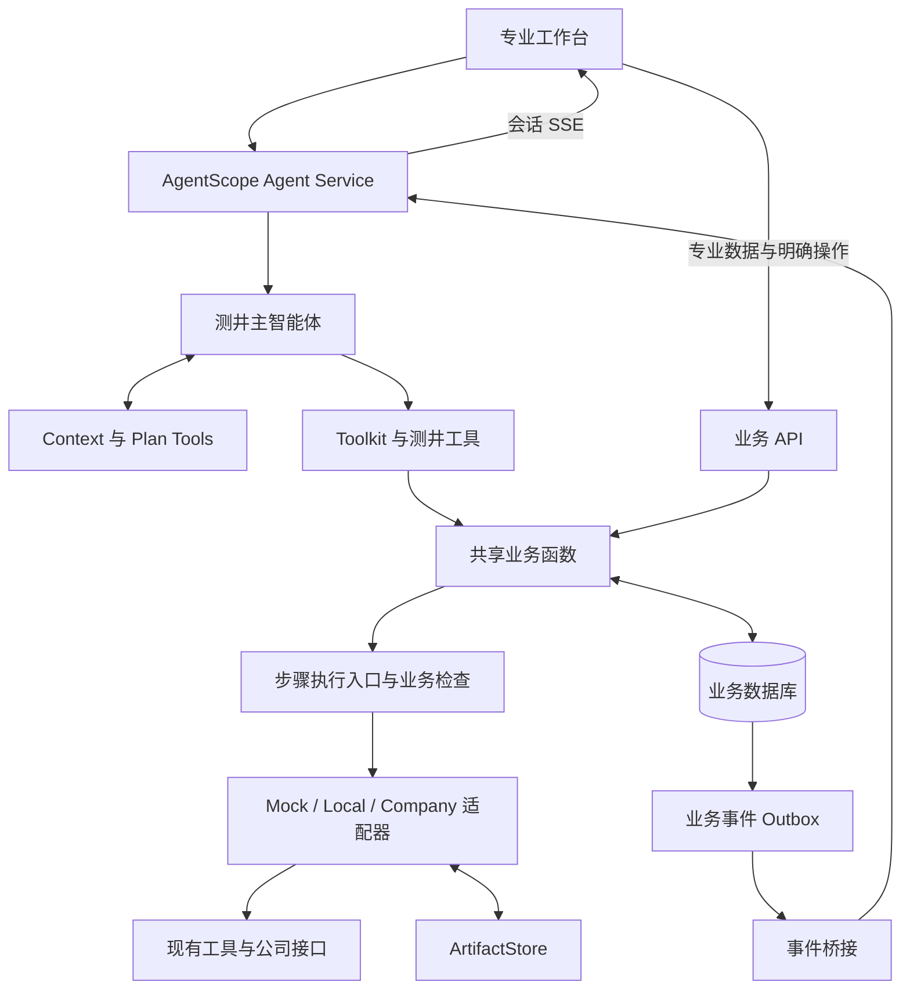
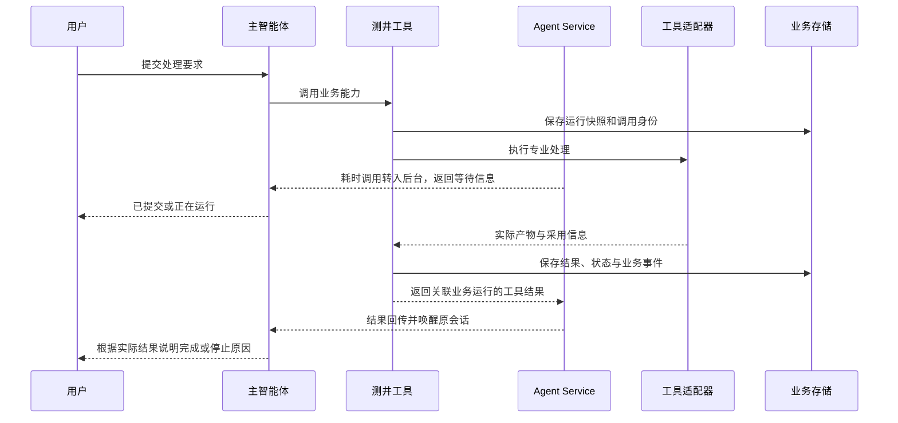

# 详细技术框架方案

> 日期：2026-10-06
>
> 状态：设计基线仍待业务评审。AgentScope 本地框架原型、Mock 工作台、十项专业步骤运行骨架、版本比较和演示/诊断报告已在新项目实现；真实 Provider、专业参数规则和正式成果发布未接入。
>
> 设计条件：工具细节、专业规则和成果规则暂缺。框架先支持 Mock 验证，真实能力按契约和规则逐项开放。

## 1. 设计依据与可实施范围

### 1.1 资料依据

- [产品需求概要](./产品需求文档.md)。
- [项目目标概要](./项目目标概要.md)。
- [项目评估概要](./项目评估概要.md)。
- [技术框架概要](./技术框架设计.md)。
- [源业务流程文档](/Users/heyutao/Code/personal/cnlc-agentscope/docs/01-business-workflow.md)。
- [现有工具映射](/Users/heyutao/Code/personal/cnlc-agentscope/docs/architecture/four-stage-tool-mapping.md)。
- [阶段使用示意图](./assets/工具阶段使用情况-2026-10-06.png)。
- [Mock 井数据](/Users/heyutao/Code/personal/cnlc-agentscope/mock_data/WELL_MOCK_PLOT_001.json)。

本方案提取业务要求和工具能力。旧项目的交互实现不作为本方案依据。源文档中的已实现能力，不代表本项目已有对应代码。

### 1.2 信息暂缺时的设计方法

| 暂缺信息 | 本方案的处理方式 | 后续开放条件 |
|---|---|---|
| 工具接口细节 | 先定义应用侧契约。真实适配器登记为待接入。Mock 适配器实现同一外层契约。 | 完成输入输出映射、文件验证、参数采用验证和错误测试。 |
| 专业参数和规则 | 将规则定义为配置对象。未确认参数不进入允许修改清单。 | 取得规则来源、适用条件和专业参考样本。 |
| 层段计算与依赖 | 查询可使用明确层段。局部写入和局部重算暂不开放。 | 工具支持计算范围，且边界输入、依赖和合并规则已确认。 |
| 复核与成果规则 | 保存复核原因和候选结果。Mock 使用演示策略。正式结果发布暂不开放。 | 复核后操作、结果生效和报告规则已确认。 |

开发人员可以先实现会话、数据查询、工具包装、执行记录、事件、版本和工作台。

Mock 流程可以生成演示结果和演示报告。真实接口可在独立技术验证中测试传输与响应。正式业务执行和正式报告仍需满足专业规则。

### 1.3 初稿技术决策

| 决策 | 方案 |
|---|---|
| 智能体 | 一个测井主智能体。使用 AgentScope 2.0.9。 |
| 应用宿主 | AgentScope Agent Service。扩展业务路由、工具和中间件。 |
| 后端语言 | Python 3.11+。使用 Pydantic 定义应用侧契约。 |
| 数据存储 | PostgreSQL。会话存储与业务存储分别管理表和迁移。 |
| 消息总线 | 使用 AgentScope 的 Redis 消息总线适配器。 |
| 文件存储 | 受控本地目录。通过 ArtifactStore 接口访问。 |
| 工作台 | React、TypeScript。图库通过测井交互验证确定。 |
| 模型 | 通过 AgentScope 模型适配器接入。供应商和模型由部署配置决定。 |
| 报告格式 | JSON 与 Markdown。Mock 报告显示演示标识。 |

这些是初稿选型。具体依赖版本在开发时锁定，模型服务地址在部署时配置。

首个接入原型固定 Python 3.12 和 AgentScope 2.0.9。依赖锁定文件为 `uv.lock`。原型使用 SQLite、fakeredis 和脚本模型。该环境用于验证原生扩展点，不代表 PostgreSQL、独立 Redis 或真实模型已验证。

## 2. 总体架构与职责



组件以一个应用组织。首版采用单个 API 服务实例。后台工具运行优先使用 Agent Service 机制。

| 模块 | 负责内容 | 主要接口 |
|---|---|---|
| 主智能体配置 | Prompt、模型、业务 Toolkit、原生计划工具 | Agent 配置与工具工厂 |
| 上下文中间件 | 读取当前井、层段、参数方案和结果摘要 | 会话上下文快照 |
| 能力目录 | 工具状态、参数 Schema、范围、格式和适配器绑定 | 查询能力、取得工具定义 |
| 数据服务 | 井、曲线、层段、统计和资料要求 | 查询数据、读取图表数据 |
| 执行服务 | 请求校验、快照、幂等、步骤与阶段状态 | 创建业务运行、执行阶段、查询运行 |
| 适配器 | 本地工具、Mock 响应、公司接口与响应映射 | 执行能力、核实外部状态 |
| 结果服务 | 结果版本、比较、候选结果和工作版本 | 保存结果、查询版本、比较结果 |
| 报告服务 | 按结果版本生成、读取和编辑报告 | 生成演示或诊断报告 |
| 文件存储 | 曲线、GDSX、完整响应、图片和报告文件 | 写入、读取、校验 Artifact |
| 事件桥接 | 投递业务事件、关联会话、处理重复投递 | Outbox 读取与消息总线适配 |

业务对象不依赖 AgentScope 内部消息类型。工具包装负责转换框架调用和业务请求。页面与工具使用相同业务函数。

## 3. AgentScope 接入

### 3.1 原生能力与项目扩展

| 能力 | 使用方式 |
|---|---|
| `Agent` | 运行原生推理与工具调用循环。主智能体理解指令、选择工具并说明实际结果。 |
| Model / Credential | 统一配置模型和服务端凭据。 |
| `Toolkit` | 注册已开放工具。工具业务分类保存在能力目录中。 |
| `FunctionTool` | 包装轻量查询函数。显式设置只读和并发属性。 |
| `ToolBase` | 包装处理能力、复杂检查和流式结果。 |
| Context | 保存对话。注入业务摘要。按框架机制压缩和外置长内容。 |
| Plan Tools | 记录四阶段计划或后续操作计划。计划不替代业务运行状态。 |
| Middleware | 注入上下文、记录追踪并检查回复中的业务状态。 |
| Agent Service | 管理会话、SSE、后台工具运行、结果通知和会话存储。 |

Agent Service 提供 `extra_agent_tools` 和 `extra_agent_middlewares` 扩展工厂。工具工厂按用户与会话创建业务工具。中间件工厂注入业务服务和追踪组件。

在 2.0.9 中，`extra_agent_tools` 返回的工具合并到 `basic` 工具组。初版使用该入口注册工具，业务分组由能力目录管理。若需要原生 Tool Group 的动态切换，应另行验证装配方式。

服务也提供 `custom_agent_cls` 扩展入口。项目仅在标准扩展不足时使用该入口，不重写原生推理循环。

项目使用该入口限制最终工具清单。`extra_agent_tools` 只增加工具，不能单独移除默认工具。`RestrictedAgent` 按允许清单重建 `Toolkit`，保留十一项独立专业能力、五项查询与交互能力、四个计划工具和 `ToolStop`，并注册包内 Skill。模型通过原生 `Skill` 工具读取流程说明。耗时测试工具仅显式开启时加入；六个原型查询与流程提交入口不再注册给模型。最终清单由中间件记录并由测试检查。

参数与结果交互入口为 `query_interval_results`、`get_processing_parameters`、`update_processing_parameters` 和 `rerun_step`。已有层段查询读取资料或明确的保存结果，不创建新处理版本；读取成功和已有结果的业务状态分开返回。处理参数按用户、会话、井、资料版本、井段和步骤隔离，修改通过修订号比较后原子保存。重跑采用指定参数版本，只执行目标步骤，含水饱和度与流体识别阶段内顺序执行两项能力。参数快照和输入引用保存到不可变结果中；参数变化影响本步及实际依赖结果，历史可读、过期引用拒绝继续处理。当前 曲线质量检查的采样间隔定义来自样本，设置传递不代表预设数值被重新计算。

2.0.9 的原生耗时工具默认在 10 秒后转入后台。等待占位结果的框架状态为 `SUCCESS`。这仅表示框架返回了等待通知。业务运行此时仍为 `RUNNING`，用户回复必须显示等待。后台完成通知携带原始工具输出，业务接口提供运行和结果事实。

官方依据：[Agent Service](https://docs.agentscope.io/en/versions/2.0.9/deploy/agent-service)、[Python Tool](https://docs.agentscope.io/en/versions/2.0.9/building-blocks/tool/python-tool)、[Middleware](https://docs.agentscope.io/en/versions/2.0.9/building-blocks/middleware)。

### 3.2 主智能体配置

主智能体采用 `LoggingAgent` 配置名称。每个会话保存独立状态和业务绑定。

系统提示词规定：

1. 先明确当前井、数据版本和操作范围。
2. 专业数值从工具取得。
3. 用户查询时读取已有结果。
4. 完整解释使用常规测井解释 Skill；阶段顺序与依赖写在 Skill 中。
5. 修改只使用已开放参数。
6. 失败、阻断和专业复核不能通过计划修改绕过。
7. 回复必须区分已提交、正在执行、已完成和未执行。
8. 回复说明实际依据、不确定性、告警和待复核事项；数据实现与来源由工具返回。

工具集只提供已开放业务能力和必要的计划工具。默认文件、Shell、调度和团队工具不自动成为业务能力。装配时检查最终工具清单。

工作区按会话隔离。共享井文件通过 ArtifactStore 读取，不能依靠默认工作目录定位资料。

### 3.3 中间件职责

| 中间件 | 接入位置与职责 |
|---|---|
| BusinessContextMiddleware | 在本轮开始时读取选择快照。向模型提供井、层段、版本、能力和结果摘要。 |
| BusinessTraceMiddleware | 关联会话、回复、ToolCall、业务运行、步骤和物理调用。 |
| BusinessReplyMiddleware | 将执行凭据和结果事实用于最终说明。缺少完成证据时不能说明处理完成。 |
| 原生 TracingMiddleware | 记录模型调用和框架工具调用。配置追踪导出时过滤凭据与大数据。 |

写前检查仍位于共享业务函数。Agent 的 `on_acting` 不能覆盖所有页面或外部执行入口。

本轮消息绑定选择上下文修订号。模型看到的选择快照和工具执行时使用的快照必须一致。选择已变化时，写请求返回上下文冲突。

## 4. 能力目录与开放策略

### 4.1 能力定义

`CapabilitySpec` 是新框架的配置对象，建议包含：

```text
capability_id、description、business_group、stage_id、allowed_steps、
availability、accepted_formats、scope_support、input_schema、output_schema、
parameter_specs、required_inputs、adapter_binding、is_read_only、
is_concurrency_safe、timeout_policy、cancel_support、ruleset_id
```

| 开放状态 | 含义 |
|---|---|
| `AVAILABLE`（可用） | 当前适配器和契约已验证，可以在规定范围内调用。 |
| `MOCK_ONLY`（仅演示） | 只提供 Mock 场景或演示产物。 |
| `CONTRACT_PENDING`（契约待接入） | 还未完成真实接口映射。 |
| `POLICY_PENDING`（规则待确认） | 缺少执行或结果判断所需规则。 |
| `DISABLED`（未开放） | 当前不提供该能力。 |

这些状态是新框架设计值，不是源项目枚举。能力名称存在，不代表其真实接口已开放。

工具文档中的候选工具先登记为待接入。完成契约、范围与副作用测试后再开放。

### 4.2 现有能力的接入位置

| 能力组 | 来源工具或组件 | 应用侧处理 |
|---|---|---|
| 资料 | `get_well_data`，候选 `file_decode` | 规范化井与数据清单。JSON 和 GDSX 使用各自适配器。 |
| 检查与分析 | `check_curve_quality`，候选 `gdsx_completeness`、`gdsx_expansion`、`gdsx_crossplot` | 分别返回结构检查、实际统计、专业判断和图表引用。 |
| 预处理 | 公司 preprocessing，候选 `wplm_data_preprocessing`、`gdsx_standardize` | 记录实际操作与采用参数。保存新的处理文件引用。 |
| 模型与预测 | 公司 interpretation，候选 `welllog_service_list`、`wplm_model` | 查询真实模型清单。一次物理预测关联多个业务结果。 |
| 专业结果 | 岩性、物性、Sw、流体、分类、层段工具 | 读取对应执行的结果投影。缺字段不能继承整批成功状态。 |
| 后处理 | 候选 `wplm_post_process` | 规则和覆盖范围确认后开放。 |
| 结果统计 | 候选 `gdsx_ogresult_distribution`、`gdsx_ogresult_crossplot`、`gdsx_post_process` | 返回实际统计和图表，不替代解释报告。 |
| 报告 | `ReportAssembler` | 包装报告能力。`prepare_report` 仅用于报告准备。 |

### 4.3 参数定义与缺省行为

`ParameterSpec` 描述名称、类型、单位、范围、枚举、默认值、适用模型、适用范围和规则来源。

只有已确认参数进入允许修改清单。没有专业参数字典时，真实参数编辑面板显示“参数规则待确认”。系统保留查询和查看能力。

Mock 演示使用工程场景参数，如 `scenario_id`。该参数选择测试响应，不表示真实算法参数。专业输出 POR、PERM、SW 不自动成为可编辑参数。

能力目录返回参数 Schema。前端据此生成表单。工具与页面提交时都执行相同检查。

下列 JSON 是新配置示例：

```json
{
  "profile": "mock",
  "real_processing_enabled": false,
  "formal_publication_enabled": false,
  "physical_interval_write_enabled": false,
  "automatic_retry_enabled": false,
  "automatic_rollback_enabled": false,
  "professional_parameter_specs": [],
  "mock_scenario_ids": ["baseline"]
}
```

该配置保证工程验证可以继续。它不声称真实专业能力已完成。

## 5. 应用侧数据与工具契约

本节字段是新框架草案。它们不等于旧项目的 `TaskRequest` 或现有 Provider 协议。

### 5.1 主要数据对象

| 对象 | 建议字段 |
|---|---|
| Well | `well_id`、`name`、已有井资料、资料来源 |
| DatasetRevision | `dataset_revision_id`、`well_id`、父版本、输入格式、深度单位和基准、曲线目录、Artifact 引用、来源 |
| SelectionContext | 会话、当前井、数据版本、曲线、范围、查看结果、写入基准、修订号 |
| ParameterSet | 参数方案标识、能力、模型、参数值和单位、规则版本 |
| BusinessRun | 运行标识、请求标识、会话、任务、输入快照、目标范围、基准结果、处理序号、状态 |
| StepRun | 运行、步骤、状态、起止时间、输入输出摘要、告警、错误、工具调用 |
| StageRun | 运行、阶段、步骤引用、成果引用、确认模式和确认状态 |
| ProviderCall | 物理调用标识、运行、输入摘要、调用状态、外部作业标识、完整响应引用 |
| ResultRevision | 结果标识、来源运行、依赖引用、曲线和层段引用、质量信息、来源、工作版本状态 |
| ReportRevision | 报告标识、结果版本、报告类型、生成内容、人工编辑、文件引用和更新状态 |
| Artifact | 逻辑标识、归属、格式、大小、校验摘要、存储位置 |
| BusinessEvent | 事件标识、序号、会话、井、运行、结果、类型、时间和载荷 |

业务运行、步骤、验证、阶段确认、结果生效和原生 ToolCall 状态分别建模。原生工具调用结束不自动使专业结果合格。

### 5.2 范围与曲线

`ScopeSpec` 区分整井、明确深度范围和已有层段引用。层段引用必须关联结果版本和稳定标识。

样本层号先由数据服务解析为层段对象。系统不得只凭“第 5 层”跨版本执行写入。

深度范围保存顶深、底深、单位、深度基准和边界约定。服务端检查顶底顺序、数据覆盖与单位兼容。范围查询与物理局部计算是不同能力。

曲线目录保存名称、单位、数据引用和采样信息。曲线查询保留空值。绘图降采样不改变计算输入。

### 5.3 请求与结果

处理请求包含 `capability_id`、数据版本、范围、参数、模型和基准结果。宿主附加可信的会话、归属、上下文修订号和请求标识。

以下示例只提交 Mock 检查，不进行真实层段重算：

```json
{
  "capability_id": "check_data",
  "dataset_revision_id": "mock-dataset-v1",
  "scope": {
    "kind": "depth_range",
    "top": 2000.0,
    "bottom": 2010.0,
    "depth_unit": "m",
    "depth_reference": "MD",
    "boundary": "closed"
  },
  "parameters": {"scenario_id": "baseline"},
  "base_result_revision_id": null,
  "selection_revision": 3
}
```

请求受理后返回业务运行标识、实际状态和查询引用。受理成功不表示专业计算完成。

`ToolResultEnvelope` 包含：

```text
status、data、warnings、errors、metadata
```

`StageResult` 的应用侧设计包含结果、证据、冲突、缺失证据、告警、建议动作、来源和 Mock 标识。验证结果另含验证状态。

最终执行信息记录实际参数、请求范围、计算范围、更新范围、输入与产物引用。无法确认的采用参数保持未知，不能用请求值冒充实际采用值。

## 6. 四阶段执行与专业门控

### 6.1 完整解释路径

模型完整解释由 `conventional-log-interpretation` Skill 按十项专业处理的既定顺序直接调用专业工具。单项业务可独立调用对应工具。报告前检查不生成报告正文。

专业工具直接使用 `well_id`、`dataset_revision` 和顶底深，不要求预先创建会话选择。每项调用保存不可变的 `result_id`；后续通过 `input_result_ids` 引用实际前置结果。工具层检查归属、资料版本、范围和可用状态。资料完整性检查作为 `check_data_completeness` 开放，含水饱和度与流体识别对应 Sw 与流体识别两项能力；报告前检查按实际引用核实完整性。

主智能体按用户意图选择单项工具或完整解释 Skill。Skill 规定阶段顺序，工具层校验输入及结果引用。原型 HTTP 演示入口仍使用固定场景 Workflow 保存步骤、结果和报告，与模型的独立工具路径分开。

### 6.2 步骤状态

| 状态 | 下一步处理 |
|---|---|
| `PENDING`（等待执行） | 前置条件满足后开始。 |
| `RUNNING`（正在执行） | 等待实际工具结果。 |
| `SUCCESS`（执行成功） | 满足阶段条件后继续。 |
| `WARNING`（完成但有告警） | 保存告警。没有其他阻断时继续。 |
| `FAILED`（执行失败） | 保存诊断并停止专业步骤。 |
| `BLOCKED`（被阻断） | 保存缺失项并停止专业步骤。 |
| `REVIEW_REQUIRED`（需要人工复核） | 保存复核原因并停止专业步骤。 |
| `SKIPPED`（按规则跳过） | 只有明确规则允许时才能跳过。 |

外部调用的 `UNKNOWN`（结果未知）单独保存。它不表示成功，也不直接触发重复请求。

系统不自动重试、回退或换算法。原生计划工具和模型不能改变该规则。

### 6.3 资料要求与解释验证

资料要求按能力和适用条件配置。必需资料缺失停止当前链路。推荐资料缺失保留告警。可选资料缺失原则上不影响主流程。

Mock 使用样本的 `requirements`，不将其作为所有井的标准。规则未配置时，结构检查可以执行，但不能输出正式完整性通过结论。

解释验证使用以下分支：

- `CONSISTENT`（证据一致）：继续报告前检查。
- `PARTIAL_CONFLICT`（部分冲突）：保存告警后继续检查。
- `SERIOUS_CONFLICT`（严重冲突）：进入专业复核。
- `INSUFFICIENT_EVIDENCE`（证据不足）：进入专业复核，不表述为解释错误。

### 6.4 三类确认

| 类型 | 检查内容 | 信息暂缺时的处理 |
|---|---|---|
| 工具授权 | 当前用户是否可以调用该能力 | 由宿主身份和业务归属检查决定。 |
| 阶段确认 | 当前成果是否允许下游消费 | Mock 可使用明确的演示自动确认策略。真实策略未配置时不自动通过。 |
| 专业复核 | 证据冲突或不足是否得到专业处理 | 保存问题和证据。正式复核后的继续入口暂不开放。 |

阶段确认只接受归属正确、版本有效、质量状态允许的成果。失败、阻断或专业复核结果不能通过“继续”绕过。

人工确认绑定运行、阶段、成果版本和确认者。重复确认不再次提交计算。确认与新结果发生冲突时拒绝旧确认。

报告前检查先检查步骤完成、错误、缺失和复核事项。结构检查通过不代表井段覆盖或地质自洽性已通过专业验证。

## 7. 持续交互与参数修改

### 7.1 查询与写入路径

| 请求 | 路径 |
|---|---|
| 查看井、曲线、层段或报告 | 解析对象与版本，直接查询。 |
| 统计与交汇图 | 读取选定范围的实际数据，返回统计和图表引用。 |
| 完整解释 | 固定输入与参数快照，启动四阶段执行。 |
| 参数修改 | 查询能力 Schema，检查参数与依赖，创建新运行。 |
| 结果比较 | 指定两个版本，检查单位、深度对齐和字段。 |
| 重生成报告 | 指定已有成果版本，单独检查报告条件。 |

查询与报告读取不自动启动资料准备步骤。对象或单位有歧义时先澄清。

### 7.2 修改步骤

1. 读取本轮选择快照。
2. 解析已开放参数或 Mock 场景。
3. 检查数据归属、范围、单位和值域。
4. 检查基准结果和规则版本。
5. 根据已确认依赖确定必要执行边界。
6. 保存新参数方案与运行快照。
7. 执行并生成新的候选结果。
8. 展示前后比较和报告更新状态。

专业依赖未确认时，真实参数修改返回规则待确认。不会猜测重算起点。Mock 场景使用明确的测试执行模板。

### 7.3 工作版本与正式成果

工作版本用于查看和比较。Mock 可设置当前演示工作版本，但其来源仍为 Mock。

正式结果生效是单独操作。缺少成果规则时，该操作暂不开放。工作版本切换不表示专业验收或正式发布。

局部结果合并必须有明确规则。工具只支持整井时，系统说明实际范围，不静默将层段写请求扩大为整井。

## 8. 存储结构与事务

### 8.1 业务表草案

以下是新数据库设计，不沿用源项目表结构。

| 表 | 主要关系与约束 |
|---|---|
| `wells` | 保存井资料与归属。 |
| `dataset_revisions` | 关联井、父版本和输入 Artifact。版本创建后不原地修改采样数据。 |
| `selection_contexts` | 按会话保存选择。修订号用于乐观并发检查。 |
| `parameter_sets` | 保存参数、单位、能力和规则版本。 |
| `business_tasks` | 关联井与会话。保存当前工作结果引用和最新处理序号。 |
| `business_runs` | 关联任务、数据版本、参数、基准结果和输入快照。 |
| `step_runs` | 关联业务运行和步骤。记录每次执行事实。 |
| `stage_runs` | 关联阶段成果和确认状态。阶段展示引用步骤结果。 |
| `provider_calls` | 保存一次外部调用的身份、状态、请求摘要和响应引用。 |
| `result_revisions` | 关联来源运行、产物和依赖。保存质量与来源。 |
| `report_revisions` | 关联指定结果版本、报告类型和编辑版本。 |
| `artifacts` | 保存逻辑文件身份、校验摘要、格式和归属。 |
| `business_events` | 保存可重放的业务事件和单调递增序号。 |
| `event_outbox` | 关联待投递事件、投递状态和次数。 |

会话表由 AgentScope 存储适配器管理。业务表使用独立迁移。两者通过会话标识关联，不直接修改框架内部会话 JSON。

建议数据库约束与索引：

- 请求标识在身份归属范围内唯一。
- 阶段和步骤记录必须归属同一业务运行。
- ProviderCall 对同一运行、操作和请求摘要设置唯一约束。
- 结果和报告必须引用归属一致的输入、运行和版本。
- 业务事件序号唯一，按会话、井和运行建立查询索引。
- 确认更新和工作版本切换使用修订号或行锁检查。

### 8.2 幂等与并发

页面请求使用客户端请求标识。工具请求绑定本轮用户操作标识和规范化请求内容。同一操作的重复提交返回已有运行。

相同请求标识携带不同内容时，服务拒绝请求。新的明确重跑使用新的操作标识。

业务任务分配递增处理序号。结果切换在事务中检查：

1. 输入版本仍匹配。
2. 基准结果仍匹配。
3. 运行序号符合当前生效条件。
4. 结果质量与来源满足相应策略。

较早运行的结果迟到时保存历史产物，不自动覆盖较新的处理选择。新运行失败时保留已有工作结果。

跨会话的同井写入也经过业务任务或井级版本检查。原生会话锁不能替代该检查。

### 8.3 事务与文件

结果元数据、运行状态、业务事件和 Outbox 在同一数据库事务中写入。

文件先写入临时区域。ArtifactStore 校验大小、格式和摘要后生成逻辑引用。数据库记录引用后，文件成为可查询产物。

事务失败可能留下孤立文件。清理任务只处理没有业务引用且超过保留期的文件。保留期由部署配置决定。

大曲线和完整 Provider 响应进入文件存储。数据库保存有界摘要，不存入日志或聊天上下文。

## 9. 长任务、超时与恢复

### 9.1 原生后台运行与业务记录

Agent Service 的 ToolOffloadMiddleware 将耗时工具转入后台，并在完成后通过会话消息机制返回结果。项目为该工具绑定 BusinessRun 标识。



原生后台任务管理不等于持久化专业作业队列。2.0.9 的 BackgroundTaskManager 使用进程内 asyncio 任务登记。业务数据库必须保留可核实的运行与 ProviderCall。

框架机制依据：[Agent Service 架构](https://docs.agentscope.io/en/versions/2.0.9/deploy/agent-service)。

首版不承诺进程重启后自动恢复任意本地计算。重启后先读取业务记录，再按适配器恢复能力处理。

### 9.2 外部调用身份

远程请求发出前，服务先保存 ProviderCall。记录稳定调用标识、数据版本、参数摘要和外部操作。

多个专业结果引用同一 ProviderCall。批量预测只发出实际需要的物理请求。

外部接口支持作业查询时，保存外部作业标识并核实状态。没有查询能力时，超时或失联保持结果未知，等待核实。

同一成功调用可在同一运行中复用。跨运行缓存需匹配输入、范围、模型、参数和适配器版本，并有明确复用规则。

### 9.3 超时与取消

分别配置连接超时、读取超时、工具卸载时机和作业核实策略。原工具文档中的 10 秒与 660 秒默认值不直接作为新方案统一预算。

会话中断停止本轮智能体继续调用工具。后台任务中断与远程作业取消分别记录。适配器不支持取消时，服务返回“取消未支持”，并继续核实实际运行状态。

确认超时、ToolCall 结束或 HTTP 连接关闭，均不能证明外部作业已停止。

## 10. 后端接口与事件

### 10.1 接口边界

Agent Service 管理原生会话、聊天和会话 SSE。业务接口放在 `/business` 路由下，避免与原生资源接口混淆。

| 业务接口草案 | 用途 |
|---|---|
| `POST /business/datasets/import-mock` | 导入指定 Mock 样本并建立逻辑版本。 |
| `GET /business/wells/{id}` | 读取井信息。 |
| `GET /business/datasets/{id}/manifest` | 读取曲线、格式、来源和采样清单。 |
| `GET /business/datasets/{id}/curves` | 按曲线和范围读取绘图数据。 |
| `GET /business/results/{id}/intervals` | 读取指定结果版本的层段。 |
| `GET /business/capabilities` | 查询能力状态和参数 Schema。 |
| `PUT /business/sessions/{id}/selection` | 按修订号更新当前选择。 |
| `POST /business/runs` | 页面提交明确处理请求。 |
| `GET /business/runs/{id}` | 读取运行、步骤、阶段和产物。 |
| `POST /business/stages/{id}/confirm` | 确认符合条件的指定成果。 |
| `POST /business/runs/{id}/cancel` | 请求取消并返回实际支持状态。 |
| `GET /business/results/{id}` | 查询结果及来源。 |
| `POST /business/comparisons` | 比较两个明确结果版本。 |
| `POST /business/reports` | 生成指定版本的演示或诊断报告。 |
| `PATCH /business/reports/{id}/annotations` | 保存人工说明，检查报告编辑版本。 |
| `GET /business/reports/{id}` | 读取报告与文件引用。 |
| `GET /business/artifacts/{id}` | 按归属读取文件或图表。 |

工具不通过内部 HTTP 绕一圈调用自身。工具与路由直接调用同一应用服务。

身份从部署身份组件取得。不能把浏览器传入的任意用户标识直接当作授权。对每个对象检查井、会话、任务、运行和版本的归属。

### 10.2 事件协议

事件包含应用事件标识、类型、时间、业务序号、会话、井和运行关联。结果事件另含结果版本与产物引用。

```json
{
  "event_id": "evt-demo-001",
  "sequence": 1,
  "type": "business.step.updated",
  "session_id": "session-demo",
  "well_id": "WELL_MOCK_PLOT_001",
  "run_id": "run-demo-001",
  "occurred_at": "2026-10-06T10:00:00+08:00",
  "payload": {
    "stage_id": "PREPROCESS",
    "step_id": "data_completeness",
    "status": "WARNING",
    "source": "MOCK",
    "artifact_refs": []
  }
}
```

这是协议示例，不是实际执行记录。事件类型建议包括选择更新、步骤更新、阶段等待确认、结果生成、工作版本切换、报告待更新和错误。

Outbox 允许重复投递。前端按应用事件标识去重。原生 SSE 事件标识与应用事件标识分别保存，不假设二者相同。

业务状态事件更新页面。工具完成后的原生后台结果负责会话唤醒。事件桥接避免再次对同一完成结果重复触发总结。

重连优先使用原生事件重放。重放窗口不足时，页面重新读取业务快照，再续订事件。业务事件保存于数据库，用于恢复和核对。

## 11. 工作台与报告

### 11.1 页面组件

| 组件 | 读取与操作 |
|---|---|
| WellPanel | 井资料、曲线清单、来源、测量信息和资料缺口 |
| StageNavigator | 四阶段状态及步骤产出。点击只定位页面。 |
| LogPlot | 多道曲线、深度联动、范围选择、层段覆盖和版本叠加 |
| ParameterPanel | 能力 Schema、参数草稿、Mock 场景和实际采用值 |
| QualityPanel | 空值、统计、交汇图、检查依据和受影响范围 |
| ResultPanel | 岩性、物性、流体、分类、层段、来源和版本比较 |
| ReportPanel | 演示或诊断报告、人工说明、下载和更新状态 |
| ChatPanel | 指令、澄清、工具状态和基于证据的结果说明 |

前端区分服务端业务状态、页面浏览状态和未提交参数草稿。页面滚动不改变执行步骤。

当前显示的历史结果与写入基准分别记录。隐式写入遇到对象冲突时，先澄清。

### 11.2 曲线与层段

曲线接口返回数据版本、深度基准、单位、采样及数据。图表只绘制服务器返回的数据。

显示降采样保留峰值和空值信息，具体算法通过图表验证选择。计算始终读取原始采样。

选中层段后，工作台更新 SelectionContext。后续指令携带对应修订号。输入版本变化后，旧选择需重新解析。

比较先检查字段、单位和深度基准。暂不提供跨基准自动配准。缺少可比较字段时如实返回。

当前 `plot_curves` 已注册为独立模型工具，支持指定井段的原始曲线或明确结果引用中的曲线，线性及指定曲线对数横轴、多道图和空值断线。图表是独立 SVG 文件，原生工具元数据提供受控读取引用，聊天工具渲染器即时展示并下载。文件读取检查用户、Agent 和会话归属；模型不接收完整曲线或 SVG 文本。当前每图最多八道，未实现缩放、版本叠加或交汇图。

### 11.3 报告类型与更新

新框架建议定义三种报告类型：

- `DEMO`（演示）：使用 Mock 结果。页面与文件均显示来源。
- `DIAGNOSTIC`（诊断）：记录失败、阻断、复核或未知情况。
- `FORMAL`（正式）：满足成果规则后才开放。

这是新设计分类，不表示源项目已有三个枚举。

正式报告至少需要匹配结果版本、成功或告警终态、已核验的必要专业产物及有效成果规则。规则暂缺时，正式报告接口返回规则待确认。

报告保存自动生成内容和人工说明的独立版本。新结果生成后，旧报告标记待更新。更新不能静默覆盖人工说明。

结构化 JSON 是报告数据依据。Markdown 是首版展示和下载格式。Word 和 PDF 不作为首阶段要求。

## 12. Mock 验证方案

### 12.1 基础样本

样本井为 `WELL_MOCK_PLOT_001`。范围为 2000～2120 m，深度基准 MD，采样间隔 0.1 m，共 1201 个点。

输入包含 12 条曲线。预设结果包含 8 条曲线和 20 个层段。GR 有 4 个空值，AC 有 10 个空值。

MockAdapter 读取原始资料和预设结果。统计工具实际计算点数、空值、有效率和区间统计。专业结果保持预设来源，不宣称由真实算法计算。

样本单位仅用于该样本。它们不自动成为真实工具的输入单位契约。

### 12.2 拟制作的工程场景

| 场景 | 工程构造方法 | 验证目标 |
|---|---|---|
| 基线 | 使用原始样本和预设输出 | 完整演示流程与页面联动 |
| 推荐资料缺失 | 按样本要求删除对应辅助资料 | 告警保留与继续处理 |
| 必需资料缺失 | 删除样本要求中的一条必需曲线 | 阻断、缺失范围与诊断报告 |
| 工具失败 | Mock 适配器返回约定错误 | 停止后续步骤，保留已有结果 |
| 严重冲突 | 验证 Mock 返回严重冲突标签 | 专业复核状态和停止 |
| 证据不足 | 验证 Mock 返回证据不足标签 | 说明证据不足，不表述为解释错误 |
| 状态未知 | Mock 外部调用返回未知状态 | 不重复提交，不显示成功 |
| 新结果版本 | 工程侧制作另一套明确标识的预设曲线 | 参数场景、版本比较和报告待更新 |
| 旧结果迟到 | 按测试脚本改变完成顺序 | 较早结果不覆盖较新的工作选择 |

这些场景是拟新增测试数据，不是现有样本已具备的能力。工程侧可以制作场景，不要求用户先提供专业算法规则。

第二套预设曲线只用于交互和绘图测试。其差异不表示真实参数对算法的作用。

## 13. 错误合同与验收

### 13.1 业务错误

以下代码是新方案建议值。开发时集中维护错误词典。

| 错误码 | 含义与处理 |
|---|---|
| `OWNERSHIP_MISMATCH`（对象归属不符） | 拒绝读取或写入。 |
| `STALE_SELECTION`（选择已变化） | 要求重新确定操作对象。 |
| `VERSION_CONFLICT`（版本冲突） | 保留已有结果，拒绝旧基准写入。 |
| `UNSUPPORTED_PARAMETER`（参数未开放） | 返回当前允许参数，不执行处理。 |
| `POLICY_NOT_CONFIGURED`（规则未配置） | 说明缺少的规则，不生成正式结论。 |
| `SCOPE_UNSUPPORTED`（范围未支持） | 说明实际能力，不静默扩大写范围。 |
| `INPUT_FORMAT_UNSUPPORTED`（输入格式未支持） | 返回允许格式，不猜测转换。 |
| `INVALID_OUTPUT`（工具输出不合法） | 保存安全错误并停止当前步骤。 |
| `PROVIDER_UNKNOWN`（外部结果未知） | 保留调用身份，等待核实。 |
| `CANCEL_UNSUPPORTED`（取消未支持） | 保留实际运行状态。 |
| `SCENARIO_NOT_CONFIGURED`（演示场景未配置） | 不编造变化结果。 |

非法请求在创建业务运行前拒绝。已执行步骤的失败写入 StepRun。错误回复不包含凭据、内部路径或完整外部响应。

### 13.2 验证顺序

1. 验证 Agent Service 的工具工厂、中间件、最终工具清单和会话隔离。
2. 验证 Mock 导入、查询、统计、曲线和层段接口。
3. 验证阶段执行、确认、复核、诊断报告和异常分支。
4. 验证后台工具与 BusinessRun 关联、完成通知、中断和重启核实。
5. 验证版本比较、迟到保护和报告更新。
6. 逐项接入真实工具并进行专业验证。

关键测试要求：

- 同一操作通过页面和聊天提交，实际对象、参数和规则一致。
- 资料缺失、失败和复核不能被计划修改或“继续”绕过。
- 后台等待信息不能渲染为专业处理完成。
- 参数实际采用信息与工具响应一致。
- 重复提交只创建预期业务运行。
- 一次预测的分项结果引用相同物理调用。
- 旧任务迟到、事件重复和页面刷新保持正确版本。
- Mock 来源始终可见，正式报告保持未开放。

响应时间和数据规模先测基线。专业准确度与正式验收门槛在参考样本和规则确定后设置。

## 14. 目录、部署与观测

### 14.1 当前目录与职责

```text
backend/src/cnlc_agent/
  app.py          # 服务装配与兼容启动入口
  runtime.py      # 资料、存储、消息总线及共享依赖
  lifecycle.py    # 原生生命周期扩展与资源关闭
  cli.py          # 环境读取、命令行与 Uvicorn 启动
  api/            # HTTP 路由、会话归属与错误转换
  agent/          # 工具包装、白名单、中间件与模型适配
  contracts/      # Pydantic 请求与工具参数
  business/       # 会话业务、范围检查、错误与版本比较
  repositories/   # 业务和 Workflow 的 SQLite 持久化
  adapters/mock/  # 样本资料与专业结果 Fixture 适配
  workflow/       # 固定步骤、场景、执行、阶段和摘要
  reports/        # 绑定版本的 Markdown 报告组装
  catalog.py      # 分层能力目录
  prompts/、skills/、data/
  static/agentscope/  # React 构建产物
tests/            # 业务、流程、HTTP、SSE 和模型接入验证
frontend/src/
  api/types/      # 按业务领域分开的类型契约
  pages/chat/     # 页面装配、会话状态、导航、面板和附件
  pages/credential/、mcp/、skill/  # 业务页面和展示组件
  components/chat/  # 消息外壳、内容块、音频、思考块和工具组
frontend/tests/   # 面板布局、消息分组、参数及附件回归测试
```

当前目录保留 `framework.py`、`business` 与 `workflow` 的旧导入兼容入口；内部实现直接依赖职责模块。路由与 Agent 工具使用相同业务操作，业务和仓储不依赖 AgentScope 消息类型或 FastAPI。流程通过仓储读取步骤，报告渲染只消费运行和结果事实。

独立测井工作台已移除。此处目录描述当前原型；后续真实 Provider、ArtifactStore、Outbox 与规则配置按接入需求增加，目前不创建空实现。

### 14.2 首版部署

部署静态前端、单实例 Agent Service、PostgreSQL、Redis 和受控 Artifact 目录。模型服务与公司服务是外部连接。

会话和业务迁移分别执行。API 启动时检查依赖、开放能力和规则配置。模型配置缺失时，数据查看仍可独立使用，但智能体接口返回配置未就绪。

首版不依赖分布式专业 Worker。扩大部署前先验证原生服务的多实例边界、会话锁、Outbox 投递和作业恢复。

配置统一包含模型、存储、能力绑定、输入格式、超时、场景和规则版本。凭据由服务端环境或密钥配置注入。

### 14.3 观测

日志和追踪关联用户操作、会话、回复、井、BusinessRun、StepRun、ToolCall 和 ProviderCall。

记录采用参数、范围、状态、耗时、结果引用、告警和安全错误。完整曲线与响应不写入普通日志。

评估记录同时保留用户指令、实际调用和产物。对话文本不是任务成功的唯一证据。

## 15. 实施产物与规则接入

### 15.1 可先完成的工程产物

| 阶段 | 主要产物 |
|---|---|
| 框架装配验证 | Agent Service 扩展、工具白名单、会话存储与事件原型 |
| 数据工作台 | Mock 数据适配、资料清单、曲线、层段和实际统计 |
| 业务执行 | 四阶段模板、状态、确认检查、异常分支和运行记录 |
| 持续迭代 | Mock 场景、新结果版本、比较、迟到保护和报告更新 |
| 真实接入 | 逐项完成工具契约、采用参数、范围及外部状态验证 |

### 15.2 后续补齐信息的位置

| 信息 | 接入对象 | 缺少时的系统行为 |
|---|---|---|
| 工具样例与格式 | Provider Adapter、输入输出 Schema | 真实能力保持待接入。 |
| 参数与单位 | ParameterSpec | 未确认参数不开放修改。 |
| 数据要求 | RequirementRule | 仅做结构检查，正式完整性结论保持待确认。 |
| 专业算法与阈值 | RuleSet、专业工具 | 保留原始结果与证据，不补造专业判断。 |
| 局部计算与合并 | ScopePolicy、DependencyRule、MergePolicy | 局部写入暂不开放。 |
| 专业复核后继续 | ReviewPolicy | 保存复核状态，正式继续入口暂不开放。 |
| 正式结果与报告 | PublicationPolicy、ReportPolicy | 只提供演示或诊断产物，不发布正式成果。 |

规则对象保存标识、版本、状态、适用范围和来源。规则更新不能静默改变已有运行快照。

用户暂时不能补齐专业信息，不影响上述工程设计和 Mock 验证。方案完整与专业能力开放分别评审。

当前本地 AgentScope 官方 Web UI 的启动方式、实现边界和验证命令见[项目 README](../README.md)。本地环境模型从 `.env` 读取；真实业务能力仍按接口契约和专业规则逐项开放。
